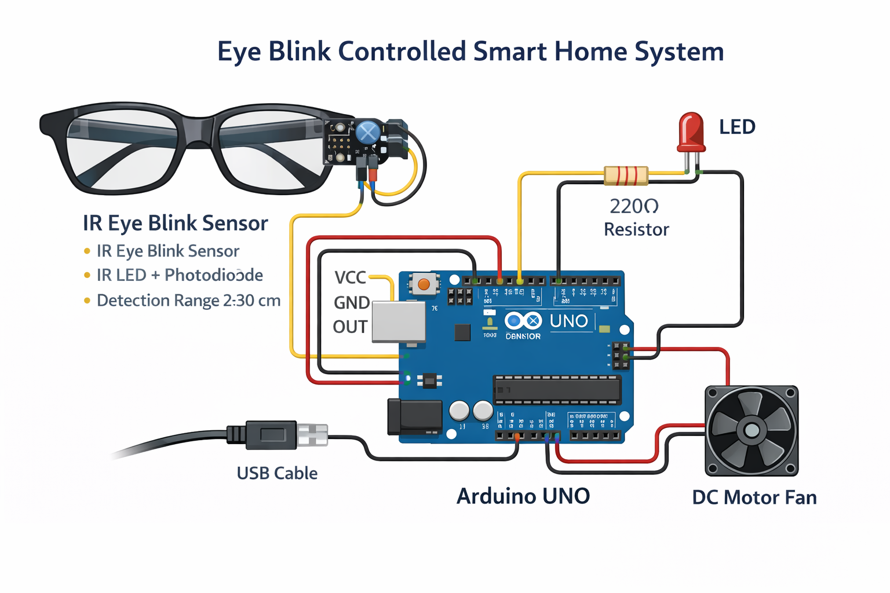

# 👁️ Smart Home Control Using Eye Blink System 🏠

## 🔍 Overview
This project demonstrates an **assistive smart home automation system** that allows users to control home appliances using **eye blink detection**.  
The system enables **hands-free control**, making it especially useful for **physically challenged individuals** and as a practical project to understand **embedded systems and sensor-based human–machine interaction**.

An **IR Eye Blink Sensor** is interfaced with an **Arduino UNO**, which processes blink signals and controls appliances such as an **LED (bulb)** and a **DC motor fan**.

---

## ❓ Problem Statement
Conventional home automation systems require physical switches or smartphone applications, which may not be accessible to all users.  
This project addresses that limitation by using **eye blinks as an input mechanism**, offering a **simple, low-cost, and accessible control solution**.

---

## 🧠 System Architecture
The system consists of three main units:

- **👁️ Input Unit:** IR Eye Blink Sensor  
- **🧩 Processing Unit:** Arduino UNO  
- **💡 Output Unit:** LED and DC Motor Fan  

The sensor detects eye blinks and sends a digital signal to the Arduino.  
The Arduino applies **debounce and threshold logic** and toggles the connected appliances accordingly.

---

## 🧰 Hardware Components
- Arduino UNO  
- IR Eye Blink Sensor (IR LED + Photodiode based)  
- LED with 220Ω current-limiting resistor  
- DC Motor Fan (3V–5V)  
- Jumper wires  
- USB power supply  

---

## 💻 Software & Tools
- Arduino IDE  
- Embedded C/C++  
- Digital I/O handling  
- Debouncing logic for reliable signal detection  

---

## ⚙️ Working Principle
1. The IR eye blink sensor continuously monitors eye movement.
2. When an eye blink occurs, the sensor output changes state.
3. The Arduino reads the signal through a digital input pin.
4. Debounce logic filters noise and avoids false triggering.
5. A valid blink toggles the appliance state (ON/OFF).
6. The LED and DC motor respond in real time.

---

## 🧪 Features
- ✅ Hands-free appliance control  
- ⚡ Real-time response  
- 💸 Low-cost and simple design  
- 🛡️ Reliable operation using debounce logic  
- ♿ Suitable for assistive technology applications  

---

## 🏠 Applications
- Smart home automation  
- Assistive technology for physically challenged users  
- Embedded systems and Arduino learning projects  
- Human–machine interaction prototypes  

---

## 🧩 Circuit Diagram
Below is the circuit diagram for the Eye Blink Controlled Smart Home System:



---

## 📁 Project Structure
```

smart-home-eye-blink-control/
│
├── README.md
├── src/
│   └── eye_blink_control.ino
├── circuit/
│   └── eye_blink_wiring.png
├── demo/
│   └── demo_video.md
└── docs/
└── project_overview.pdf (optional)

```

---

## 🎥 Demo Video
▶️ **Google Drive Demo Video:**  
https://drive.google.com/file/d/1jY229wMUbRFR3acYHKq9rBnA1eAwwHH8/view?usp=drive_link  

The demo video shows:
- Eye blink detection using IR sensor  
- Arduino processing and serial output  
- LED and DC motor fan switching  
- Real-time system response  

---

## 🚀 Future Enhancements
- Blink pattern recognition (single blink / double blink control)  
- Relay module integration for high-power appliances  
- Wireless control using Bluetooth or Wi-Fi  
- Integration with mobile or voice-based interfaces  

---

## 👨‍💻 Author
**Ashwin Sharma**  
B.Tech – Electronics & Communication Engineering  
Avanthi Institute of Engineering and Technology  

---

✨ *This project focuses on practical implementation, hardware–software integration, and clear documentation, demonstrating strong fundamentals in embedded systems, sensors, and automation.*
```

